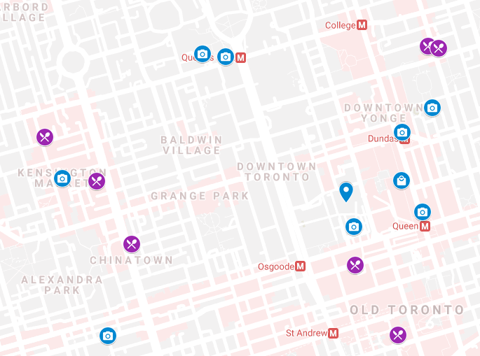
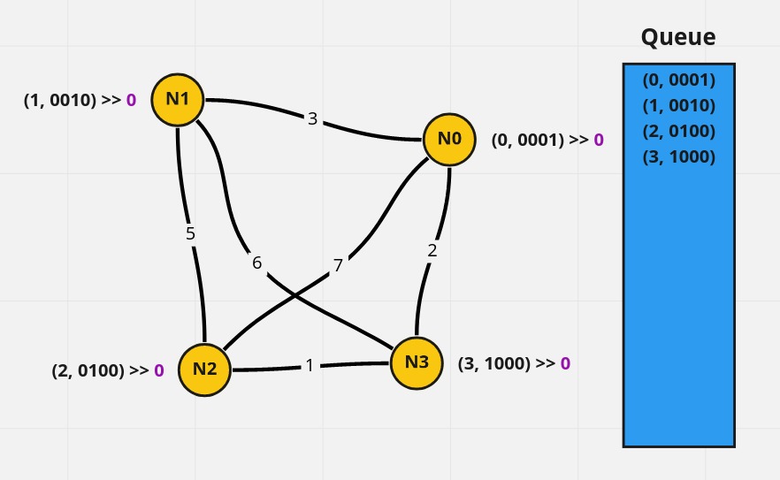
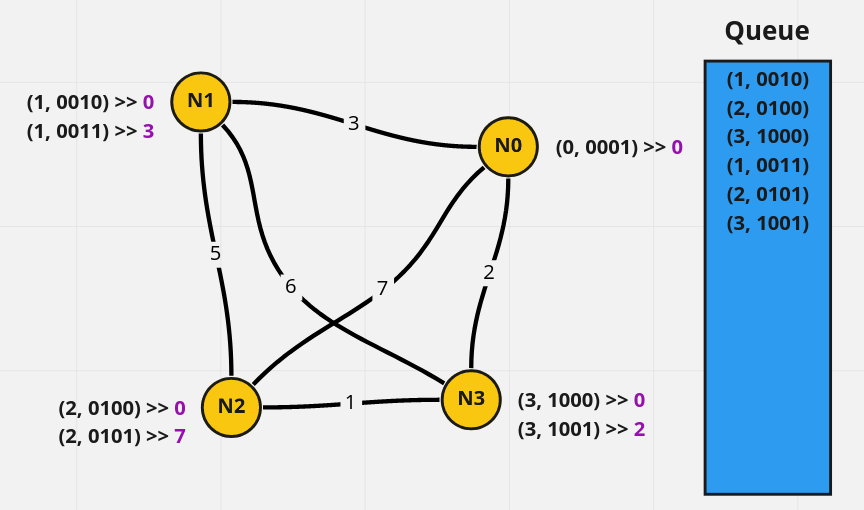

# Planning Your Next Vacation Using Graph Theory and Genetic Algorithms

Planning a vacation is hard work, with so many different points of interest (POI) and limited time it is difficult to create an itinerary that simultaneously aims to hit as many points of interest as possible in an optimized fashion and does not make the vacation feel too stressful.
Additionally, since there are always more points of interest than you have time for, nailing down an itinerary means deciding which POI's to skip and living with the lingering doubt that the attaction you skipped would have provided a life-changing experience.
While the algorithm prefrsented here cannot garauntee that you won't miss out on any life-affirming moments in your travels, it will allow you to blame missed attractions on an internet stranger's silly algorithm which is the closest you can get to peace of of mind this situation

# The Human Inputs 

Before we can let the algorithm take over all the decision making responsibilities, we first have to gather data about the personal preferences of all the members of the party.
To do this we must first come up with an exhaustive list of attractions in a city.
Aside from the common list of attractions that can be found on any given travel blog and youtube videos, a wonderful resource called Atlas Obscura provides a large cache of lesser-known attractions in each city.
Once such a list is compiled, the two most important pieces of information for each POI in this list are:

1. `dwell_time`: an estimate of the time spent at each POI 
2. `score`: some kind of positive-definite score assigned to each point of interest indicating the level of interest from the members.

The information here should be stored in a csv file.

# Get Latitude and Longitude from Google Maps

Once the full list of POIs is compiled, we will need to get their exact position on the map.
To do this, we will first use Google's My Map feature to store and visualize all of the POI's in a city. 

Then, we will add each POI to the map by hand and export the data to an `kml` file, which can be parsed by our python code to get the exact latitude and longitude of each POI.

An example of the `kml` file is given in the github repo at `test_files/Toronto2021.kml`.

# Parsing the data from the user inputs

At this step you need to make sure that the names of the POI's in the `csv` file from the user input data match the names of the POI's in the `kml` file.
The data in the `user_input.csv` file should should look like this:
|                      name                      | time | score |
| ---------------------------------------------- | ---- | ----- |
| Royal Ontario Museum                           | 300  | 15.5  |
| Bamboo Forest                                  | 30   | 16    |
| St. Lawrence Market                            | 120  | 17    |
| Graduate Department of Pharmaceutical Sciences | 30   | 11    |
| Loblaws                                        | 45   | 7     |
| CF Toronto Eaton Centre                        | 150  | 14    |
| Graffiti Alley                                 | 30   | 11    |
| Thomas Fisher Rare Book Library                | 60   | 15    |
| The Monkey's Paw                               | 60   | 7     |
| Little Canada                                  | 45   | 11.5  |
| Toronto Music Garden                           | 90   | 6     |
| Kensington Market                              | 90   | 11    |
| Elgin and Winter Garden Theatre Centre         | 90   | 11    |
| Toronto City Hall                              | 120  | 14    |
| Unionville                                     | 120  | 16    |

The data from from the `csv` and `kml` files can be parsed and combined into a single dataframe using the following code:

```python
from pykml import parser
import pandas as pd

def parse_user_inputs_to_df(kml_file, user_input_csv):
    """
    Parses a KML file into a Pandas DataFrame.
    Args:
        kml_file: The path to the KML file.
        user_input_csv: A csv file with the interest score and time of each location
    Returns:
        A Pandas DataFrame with all the relevant information about the locations.
    """
    data = []
    # Parse the KML file
    doc = parser.parse(kml_file).getroot()
    for e in doc.Document.Folder.Placemark:
        # Get the coordinates and convert to float
        coords = e.Point.coordinates.text.split(",")
        # Get the name
        name = e.name.text
        # Get the coordinates
        data.append([name, float(coords[0]), float(coords[1])])
    # Create a Pandas DataFrame
    df = pd.DataFrame(data, columns=["name", "longitude", "latitude"])
    add_data = pd.read_csv(user_input_csv, index_col=["name"])
    df = df.join(add_data, how="inner", on="name")
    df.reset_index(inplace=True, drop=True)
    return df
```


# Pathfinding

Our path-finding algorithm is designed to address the question of 

>What is the least-time pathway through all combinations of nodes?

To compute this we will perform as standerd minimum cost path-finding with the additional constraint that we can only directly compare paths that have visited the exact same set of nodes.
For book-keeping purposes (and a bit of bit-twidling fun) we will use and integer bit mask to keep track of the which nodes have been visited.
The algorithm wil have use a queue that consisting of `(j, mask)` pairs where `j` is the node value to be process and `mask` is an integer where n-th bit from the right is set to `1` if and only if the n-th node has been visited. 
Note that the `j`-th bit of `mask` will always be `1` since we are assuming that `j` was the last visited node.
The complete algorithm is outlined below:

1. Initialize the queue with `(j, 1 << j)` for all `j` from `0` to `N-1`. 

2. Initialize a `least_time` dictionary with a default value of +\infty wich will be keyed by the `(j, mask)` pairs.


3. Pop a `(j, mask)` pair from the end of the queue and check all the neighbors `nn` of node `j`.

4. If `nn` is a visited node in `mask` then we ignore this node since we don't want to visit the same place twice.  In bit language this means we will only perform futher checks if `mask & (1 << nn) == 0`.

5. If `nn` has not been visited before we will check if the new time beats the current best time to reach `nn` with same set of visited nodes: `least_time[nn, mask | (1 << nn)]`, if the new time is better we will updated the `least_time` dictionary with the new best time and add `(nn, mask | (1 << nn))` to the left end of the queue.

6. Whenever `least_time[nn, mask | (1 << nn)]` is updated we will also update a `parent[nn, mask | (1 << n)]` to point to `(j, mask)` so that we can trace back the path.

7. Repeat steps 3 to 5 until the queue is empty.

A graphical illustraion of the algorithm is given below, the keys value pairs in the `least_time` dictionary are shown next to node `j`.
For simplicity we will ignore the dwell time but they are trivially added during graph traversal in the full implementation.
The queue will initialize with a single "on" bit at each node, and the value for key `(j, mask)` of then `least_time` dictionary are shown next to the node `j`.


We can then pop node `0` from the top of the queue and add the all the neighbors, with two "on" bits, to the queue.



We can keep doing this, until we have depleted all the initial nodes.
At which point the entire queue will be composed of keys with two "on" bits.
Note that up until this point, the order in which the nodes were visited did not matter since we have visited at most two nodes and the graph is undirected.


Once we start looking at the length 3 paths we see that the state `(2, 0111)` can be reached by `(1, 0011) : 3` -> `(2, 0111) : 8` and `(0, 0011) : 3 -> (2, 0111) : 10`. In this case, we only need to keep the lower value `(2, 0111) : 8`.
And since our queue poping and appending order ensures that we analyze all the paths of length N before we look at the paths of length N+1, we can be sure that the minimum is always found.

The algorithm outlined above is still incredably poor-scaling so some constraints are added to make it work.
Since we are already constrained by the amount of time in a given day, we should supply the algorithm with a `max_time` that limits the total time (dwell_time and travel_time) allowed for each path.
The full implementation of the algorithm is given in:
https://github.com/jmmshn/vacation_routing/blob/main/vacation_router/pathfinder.py


The final result of the algorithm are two dictionaries:

    1. `least_time`: a dictionary that records the least time to reach each node with the specific set of visited nodes.
    2. `parent`: a dictionary that records the previous node in the least-time path to reach each node with a specific set of visited nodes.

Assuming we don't care about where we start and end each day, the optimal path through any set of POI will just be the lowest time amoung all keys that share the same bitmask.
This can be computed quickly using the following code.

```python
best_end_for_bm = dict()
best_time_for_bm = defaultdict(lambda : math.inf)
for (k, bm), v in least_time.items():
    if k < best_time_for_bm[bm]:
        best_end_for_bm[bm], best_time_for_bm[bm] = (k, bm), v
```

# Finding the Best Combination With a Genetic Algorithm

The keys in `best_time_for_bm` dicitionary are bascially all of the bitmasks that can fit into a given day in terms of time.
We can then just cross reference these bitmasks with the scores given to each attraction (stored in `scores`) to get the total score corresponding to each bitmask:
```python
def get_score(bm):
    # calculate a score for a bitmask
    score = 0
    for i in range(bm.bit_length()):
        if bm & (1 << i):
            score += scores[i]
    return score
```

With this score function, as the fitness function, we can use the genetic algorithm to find the best combination of 3 bitmasks for a 3 day trip that will maximize the total score, with the constraint that the none of the bitmasks clash with each other.
This simplge genetic algorithm does not have any breeding mechanism and only mutates the population by keeping top few candidates and selecting a small number of bits to flip each time to generate a new population.
The number of bits to flip is taken from a Poisson distribution with mean `lam = 1.0`.
